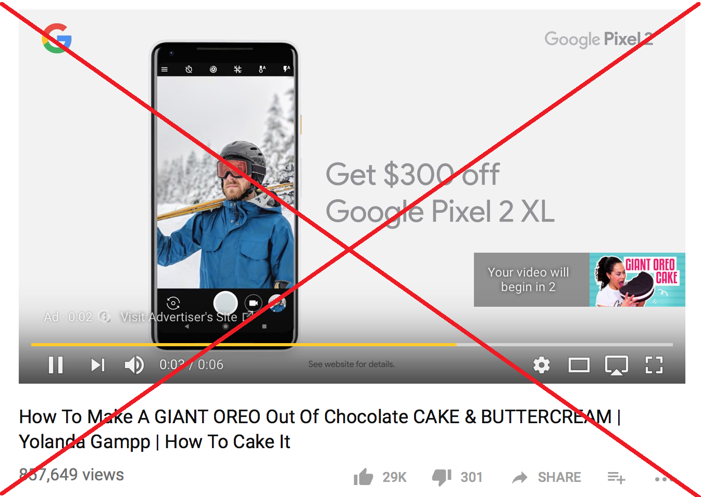

# Remove ads and sponsors on Youtube

## Intro

This is a Chrome extension. Follow the instructions below to get started

#### 1. Installation

- Clone and extract this repository.  
- Open Chrome and go to "Manage Extension" or you can copy "chrome://extensions/" and paste to the URL.
- Drag and drop the folder you extracted above

#### 2. Usage

- Once installed, the extension should start working automatically

#### License

This project is licensed under the [MIT License](./LICENSE.md)\.
